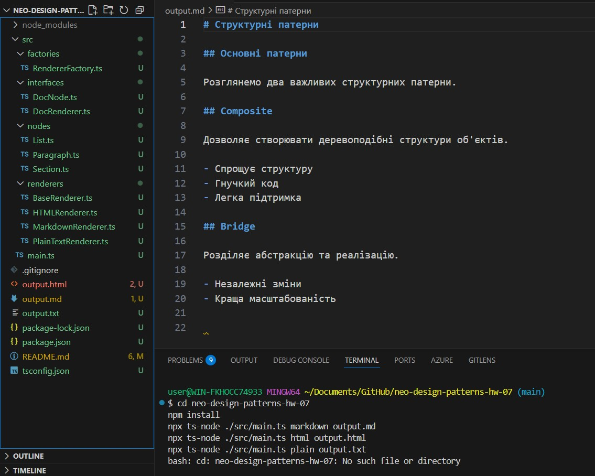
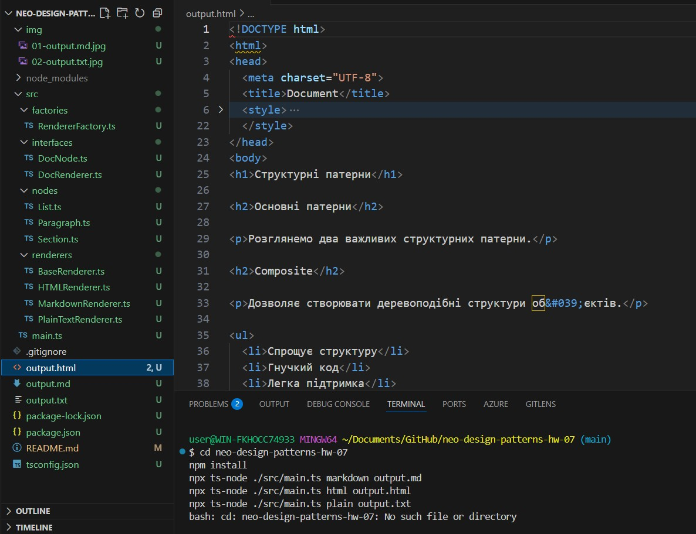
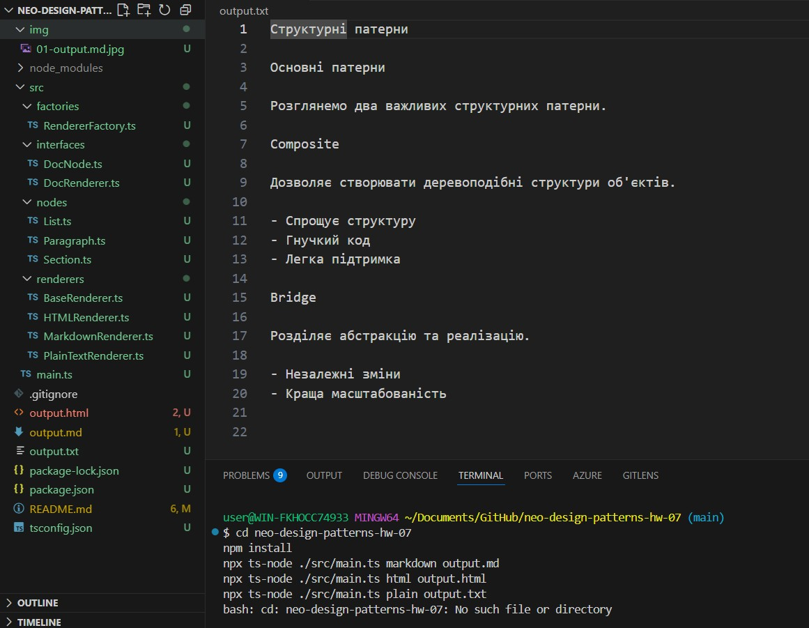

# Домашнє завдання до Теми Структурні патерни: Компонувальник та Міст

### Опис завдання

У цьому домашньому завданні необхідно буде реалізувати систему генерації документів, яка дозволяє створювати документ із кількох вкладених блоків. Буде три види блоків — параграфи, списки та секції. Документи необхідно зберігати і виводити у різних форматах: Markdown, HTML, plain text (чистий текст).

Архітектура застосунку повинна демонструвати чітке розділення відповідальностей:

- структура документа моделюється у вигляді дерева елементів, де `Section` є вузлом, який містить інші елементи;
- форматування виводу делегується окремим об’єктам — рендерерам, що реалізують єдиний інтерфейс.

Це завдання ілюструє два структурні патерни:

- Composite — має бути реалізовано в класі `Section`, який дозволяє створювати ієрархію елементів `DocNode`;
- Bridge — має бути реалізовано через інтерфейс `DocRenderer`, який можна підставляти у будь-який елемент для зміни формату виводу.

## Структура проекту

```
src/
├── interfaces/          # Інтерфейси
│   ├── DocNode.ts      # Базовий інтерфейс для всіх елементів документа
│   └── DocRenderer.ts  # Інтерфейс для рендерерів
├── renderers/          # Реалізації рендерерів
│   ├── BaseRenderer.ts      # Базовий клас для рендерерів
│   ├── HTMLRenderer.ts      # HTML формат
│   ├── MarkdownRenderer.ts  # Markdown формат
│   └── PlainTextRenderer.ts # Простий текст
├── nodes/              # Елементи документа
│   ├── List.ts        # Список
│   ├── Paragraph.ts   # Параграф
│   └── Section.ts     # Секція (Composite)
├── factories/          # Фабрики
│   └── RendererFactory.ts  # Фабрика для створення рендерерів
└── main.ts            # Точка входу
```

## Патерни проектування

### Composite

- Реалізовано в класі `Section`, який може містити інші елементи документа
- Всі елементи документа реалізують інтерфейс `DocNode`
- Дозволяє створювати деревоподібну структуру документа
- `Section` може містити `Paragraph`, `List` та інші `Section`

### Bridge

- Відокремлює абстракцію (`DocNode`) від реалізації (`DocRenderer`)
- Дозволяє незалежно змінювати формат виводу та структуру документа
- Реалізовано через:
  - Інтерфейс `DocRenderer`
  - Базовий клас `BaseRenderer`
  - Конкретні рендерери: `HTMLRenderer`, `MarkdownRenderer`, `PlainTextRenderer`

## Встановлення

```bash
npm install
```

## Використання

### Запуск з виводом в консоль

Запуск

cd neo-design-patterns-hw-07
npm install
npx ts-node ./src/main.ts markdown output.md
npx ts-node ./src/main.ts html output.html
npx ts-node ./src/main.ts plain output.txt

# Структурні патерни

## Основні патерни

Розглянемо два важливих структурних патерни.

## Composite

Дозволяє створювати деревоподібні структури об'єктів.

- Спрощує структуру
- Гнучкий код
- Легка підтримка

## Bridge

Розділяє абстракцію та реалізацію.

- Незалежні зміни
- Краща масштабованість

Де саме патерни?

Composite — клас Section реалізує DocNode і містить колекцію children: DocNode[], тобто може бути вузлом дерева документу.

Bridge — Paragraph, List, Section нічого не знають про формат, вони делегують вивід методам DocRenderer, який підставляється через конструктор; конкретні формати — в пакеті renderers/. Вибір робиться через RendererFactory.

## Рішення

npx ts-node ./src/main.ts markdown output.md



npx ts-node ./src/main.ts html output.html



npx ts-node ./src/main.ts plain output.txt


